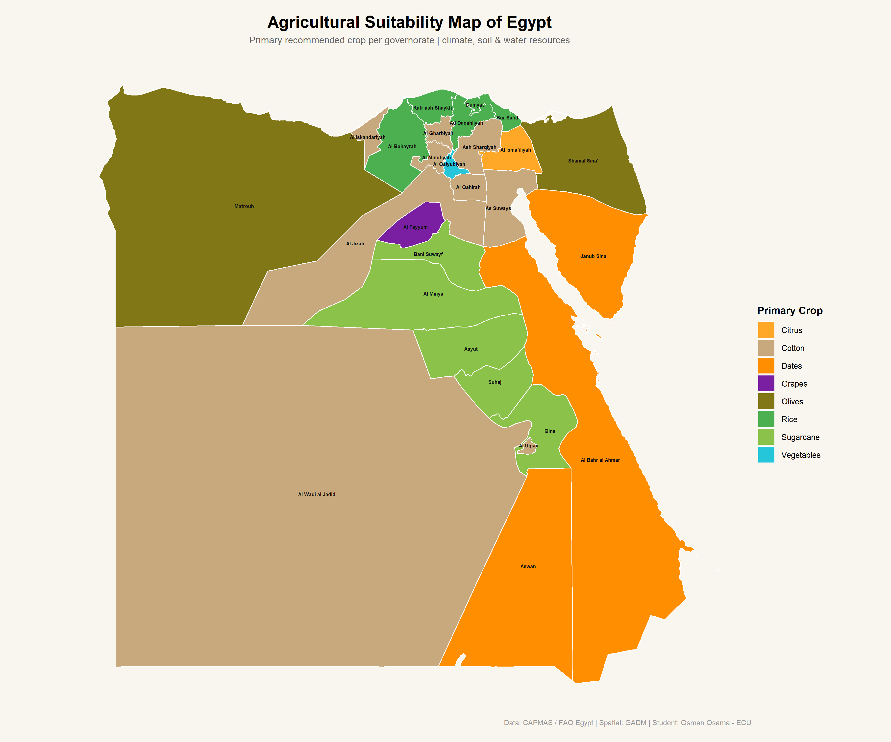

# 🌾 Egypt Agricultural Suitability — Spatial Analysis in R

> A spatial data science project mapping primary crop recommendations across all Egyptian governorates using R, GADM shapefiles, and interactive visualization libraries.

**Student:** Osman Osama · Egyptian Chinese University (ECU)  
**Course:** Spatial Statistics 
**Data Sources:** CAPMAS Egypt / FAO Egypt / GADM  

---

## 📸 Preview

### Static Choropleth Map


### Point Map (Governorate Centroids)


> 🖱️ An interactive HTML version is also generated — open `egypt_crops_map.html` or `egypt_meaningful_map.html` in any browser.

---

## 📁 Project Structure

```
egypt-agricultural-suitability/
│
├── egypt_crops_map_9.R               # Main script: choropleth + interactive map + shapefile export
├── egypt_crops_point_map_final.R     # Point map: leaflet-based interactive map by region
│
├── data/
│   ├── egypt_crops_data.csv          # Agricultural suitability data (27 governorates)
│   ├── governorate_names.csv         # Governorate names as exported from GADM shapefile
│   └── shapefile/
│       ├── egypt_crops.shp           # Merged shapefile with crop & score attributes
│       ├── egypt_crops.dbf
│       ├── egypt_crops.prj
│       └── egypt_crops.shx
│
└── outputs/
    ├── egypt_crops_map.png           # Static choropleth (primary crop per governorate)
    ├── egypt_crops_point_map.png     # Static point map (size = score, color = crop)
    ├── egypt_crops_map.html          # Interactive plotly choropleth
    └── egypt_meaningful_map.html     # Interactive leaflet point map (color by region)
```

---

## 🗺️ What the Project Does

### Script 1 — `egypt_crops_map_9.R`
- Downloads Egypt's administrative shapefile at governorate level using the **GADM** database (`geodata` package)
- Matches 27 governorates to a custom agricultural dataset (primary, secondary & tertiary crops + suitability score + key factor)
- Performs fuzzy string matching to handle Arabic transliteration differences
- Generates:
  - **Static choropleth map** (PNG) — color = primary crop
  - **Interactive plotly map** (HTML) — hover tooltips with full crop & score info
  - **Suitability score map** (PNG) — gradient from red (low) to green (high)
  - **Shapefile export** with all attributes merged

### Script 2 — `egypt_crops_point_map_final.R`
- Creates a **Leaflet-based interactive point map** with:
  - Circle markers per governorate
  - Color coded by **agricultural region** (Delta, Upper Egypt, Desert, Coast, etc.)
  - Hover labels showing top 3 crops per governorate
- Exports both HTML (interactive) and PNG (static screenshot)

---

## 📊 Dataset Overview

| Field | Description |
|---|---|
| `Governorate` | Egyptian governorate name (GADM spelling) |
| `Primary_Crop` | Main recommended crop |
| `Secondary_Crop` | Secondary crop recommendation |
| `Tertiary_Crop` | Tertiary crop recommendation |
| `Suitability_Score` | Score 0–100 based on soil, water & climate |
| `Main_Factor` | Key driver of agricultural suitability |

**Crops covered:** Rice, Cotton, Sugarcane, Dates, Grapes, Olives, Citrus, Vegetables, and more.

---

## ⚙️ How to Run

### Requirements
- R ≥ 4.2
- Internet connection (for GADM download on first run)

### Install Packages

```r
install.packages(c(
  "sf", "ggplot2", "dplyr", "stringr", "scales",
  "plotly", "htmlwidgets", "tidyr", "geodata",
  "leaflet", "mapview", "htmltools", "RColorBrewer"
))
```

### Run

```r
# Choropleth + interactive map + shapefile
source("egypt_crops_map_9.R")

# Leaflet point map
source("egypt_crops_point_map_final.R")
```

All output files are saved to your working directory automatically.

---

## 🧰 Libraries Used

| Library | Purpose |
|---|---|
| `sf` | Spatial vector data (read/write/transform shapefiles) |
| `ggplot2` | Static map rendering |
| `geodata` | Download GADM administrative boundaries |
| `plotly` | Convert ggplot maps to interactive HTML |
| `leaflet` | Tile-based interactive maps |
| `htmlwidgets` | Export interactive maps to self-contained HTML |
| `dplyr` / `tidyr` | Data wrangling |
| `stringr` | Fuzzy string matching for governorate name alignment |
| `scales` | Color scaling for suitability scores |

---

## 🌍 Key Findings

- **Nile Delta** governorates (Daqahliyah, Sharqiyah, Gharbiyah) score highest (88–90) due to rich alluvial soil and abundant water
- **Upper Egypt** (Minya → Aswan) is dominated by Sugarcane and Dates, suited to its hot dry climate
- **Desert governorates** (Wadi al Jadid, Al Bahr al Ahmar, Janub Sina') have the lowest suitability scores (38–58), relying on oasis and drought-resistant farming
- **Al Fayyum** stands out with Grapes — unique oasis agriculture supported by Lake Qarun
- **Matrouh & North Sinai** favor Olives, reflecting their Mediterranean climate

---

## 📝 Notes

- Shapefile boundaries sourced from [GADM](https://gadm.org/) (free for academic use)
- Agricultural recommendations based on CAPMAS Egypt and FAO regional crop suitability reports
- Suitability scores are composite estimates for academic purposes

---

*Egyptian Chinese University · Faculty of Computer Science · Spatial Statistics Course*
